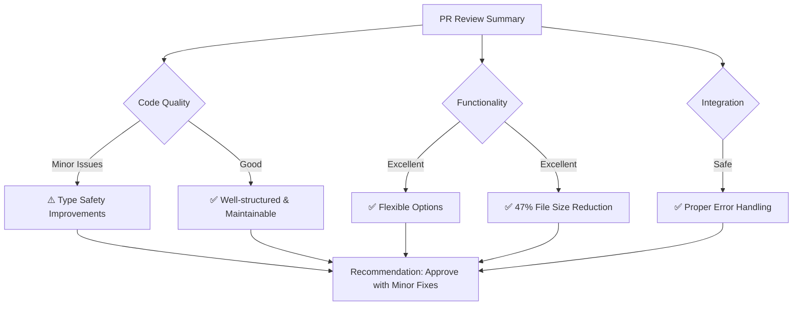

## PR レビュー: #1 feat: Simplify markdown formats and remove unnecessary metadata

### 📋 概要
このPRはGoogle DocsのJSON形式をMarkdownに変換する新しいコンバーターを実装し、不要なメタデータを削除してGitバージョン管理に適したクリーンな出力を生成します。Issue関連の記載はありませんが、元のリポジトリのPR #14をフォークリポジトリに適用したものです。

### ✅ 良い点
- **モジュール性の高い設計**: 各要素（段落、テキストラン、テーブル等）の処理が独立した関数に分離されており、非常に読みやすく保守しやすい
- **柔軟なオプション設計**: `DetailedMarkdownOptions`インターフェースにより、出力の詳細度を細かく制御可能
- **実用的なminimalモード**: ファイルサイズを約47%削減（194KB → 103KB）し、Gitでの差分管理に適した出力を実現
- **安全な統合**: `server.ts`での統合時に適切なエラーハンドリングを実装
- **リッチコンテンツのサポート**: richLinkなどの複雑な要素にも対応

### 🔍 技術的分析（Gemini AI + 総合評価）
Geminiの分析によると、このPRは全体的に高品質で、致命的なバグやセキュリティ上の懸念は見当たりません。コードは適切に構造化されており、Google Docs APIからの信頼できるデータを処理するため、セキュリティリスクも低いです。

### 💡 改善提案
#### 1. 型安全性の向上
- **問題**: `processDetailedParagraph`関数の`metaOpts`パラメータが`any`型
- **提案**: 具体的な型定義を追加
- **例**: 
  ```typescript
  // 現在のコード (行97)
  metaOpts: any = {}
  
  // 改善後
  interface ResolvedMetadataOptions {
      includeRanges: boolean;
      includeListInfo: boolean;
      includeIndentInfo: boolean;
      includeHeadingIds: boolean;
      minimalMode: boolean;
  }
  // 関数シグネチャを更新
  metaOpts: ResolvedMetadataOptions
  ```

#### 2. リスト判定ロジックの改善
- **問題**: 順序付きリストの判定が`namedStyleType`に依存しており、カスタムスタイルで不安定になる可能性
- **提案**: Google Docs APIの`bullet.listProperties`などのより信頼性の高いプロパティを使用
- **理由**: より確実なリストタイプの判定が可能

#### 3. コードコメントの追加
- **問題**: マジックナンバーや制限事項の説明が不足
- **提案**: 
  - `getDetailedIndentLevel`の`36`（行455）に「Google Docsのデフォルトインデント幅」というコメントを追加
  - テーブル処理部分にMarkdownがセル結合をサポートしない旨のコメントを追加

#### 4. ファイル末尾の改行
- **問題**: `markdownDetailedConverter.ts`の末尾に改行がない
- **提案**: コーディング規約に従い、ファイル末尾に改行を追加

### 🚨 重要な懸念事項（該当する場合）
特に重大な問題は見つかりませんでした。

### 📊 評価サマリー
- **要求適合性**: ⭐⭐⭐⭐⭐
- **コード品質**: ⭐⭐⭐⭐☆
- **テスト**: ⭐⭐⭐☆☆（テストコードは含まれていない）
- **パフォーマンス**: ⭐⭐⭐⭐⭐
- **セキュリティ**: ⭐⭐⭐⭐⭐

### 🎯 推奨アクション


**結論**: 承認（マイナー修正推奨）

このPRは優れた実装であり、プロジェクトに大きな価値をもたらします。提案した改善点は軽微なものであり、現在の実装でも十分に機能します。型安全性の向上などの改善を将来的に検討することを推奨しますが、現時点でマージして問題ありません。